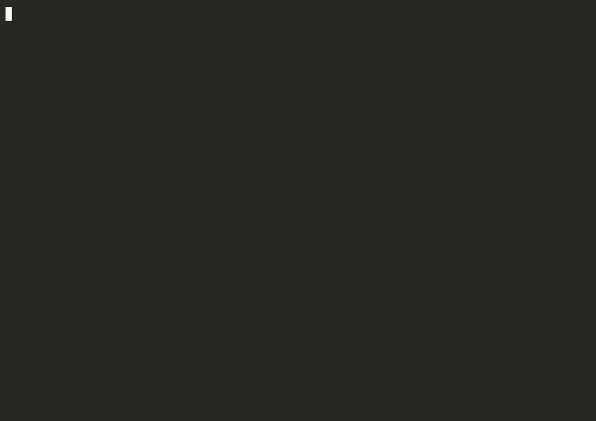

# claude-code-api-watchdog

Auto-recover Claude Code sessions that get stuck on **transient API errors**.



> *Simulated demo — the stuck-state pane is rendered by a stand-in script in
> `demo/`; the watchdog itself is the actual shipped binary. See `demo/README.md`
> for how to rebuild. A real-traffic capture follows when the watchdog catches
> one organically.*

## The problem

If you run Claude Code in automation — overnight loops, agent fleets, unattended
tasks — you've hit this: the session dies at 2am because the Anthropic API
hiccupped for a few seconds. A `529 overloaded`, a transient `429` that is
explicitly *not* your usage limit, a `500`, a connection reset. The TUI stops at
the prompt waiting for a human to type "Continue". Your loop is dead until you
wake up.

This watchdog watches your Claude Code tmux sessions and types `Continue` for
you when it detects a *transient*-error state at the prompt — a heuristic that
deliberately requires the error to persist across two consecutive polls before
acting, and that can in principle misfire on a pane *displaying* error text
(see "How detection works (and its limits)" below). It distinguishes transient
errors from real usage limits (which it leaves alone, because hammering a usage
limit just wastes attempts) and backs off exponentially.

> **Point this at UNATTENDED automation sessions — not the interactive session
> you're actively working in.** Detection is pane-scrape; the safe scope is
> "panes where a human isn't typing." Run it with `--dry-run` first to watch
> what it *would* do before you trust it live.

## What it does

- Polls each named tmux session every N seconds (`tmux capture-pane`)
- Detects a stuck transient-API-error state at the prompt
- Requires the transient-error state on **two consecutive polls** before acting
  (debounce against single-frame redraws and momentarily-displayed error text)
- Injects `Continue` with **exponential backoff** (2s → 4s → … → 120s cap) and a
  **10-attempt cap**, then escalates and stops (no infinite hammering within an
  error episode; a session that flaps healthy↔error re-arms per episode)
- Pre-clears the input line before typing `Continue`, so a misfire can't append
  to a half-typed human instruction
- Resets the moment the error clears, so the next error starts fresh
- Leaves **real usage limits** alone (detects the "resets at X" / "Rate limit
  reached" state and waits instead of spamming)
- Dismisses the "How is Claude doing?" feedback overlay if it blocks the prompt
- **Auto-restart of a dead session is OFF by default** (escalate-only). Opt in
  with `--resume-cmd`. Use `--no-restart` to force nudge-only for specific
  sessions even when you've enabled restart globally (e.g. anything that posts,
  sends, or pays — a resume could re-fire the last action)
- `--dry-run` mode logs every keystroke it *would* send without sending one

### Disabling

To stop the watchdog, stop the process: `Ctrl-C` if you ran it in a terminal,
`systemctl --user stop claude-code-api-watchdog` if you ran it as a service.
There is no "monitor without injecting" runtime flag — the watchdog's value
is the `Continue` injection; if you don't want injection, don't run it.
`--dry-run` is for validating what it *would* do during initial trust-building,
not for ongoing production observability.

## Requirements

- Claude Code running inside **named tmux sessions**
- Python 3.10+
- `tmux` and `pstree` on `PATH` (used for pane capture, send-keys, and
  process-tree liveness checks). `pstree` is in `psmisc` on Debian/Ubuntu and
  is preinstalled on most server distros; install it explicitly if missing.
- No third-party Python deps. (Escalation is just an external command you
  provide — wire it to whatever notifier you like.)

## Install

```bash
curl -O https://raw.githubusercontent.com/palios-taey/claude-code-api-watchdog/main/watchdog.py
# or clone the repo
git clone https://github.com/palios-taey/claude-code-api-watchdog.git
```

It's a single file. Copy it anywhere.

## Run

```bash
# FIRST: dry-run. Watches your sessions and logs every keystroke it WOULD
# send, without sending any. Run this for a while and confirm it only "acts"
# on genuinely stuck sessions before you trust it live.
python3 watchdog.py --sessions mybot,worker1,worker2 --dry-run

# live (escalate-only on dead processes by default)
python3 watchdog.py --sessions mybot,worker1,worker2

# with everything (incl. opt-in auto-restart of dead sessions)
python3 watchdog.py \
    --sessions mybot,worker1,worker2 \
    --interval 30 \
    --no-restart mybot \
    --resume-cmd "claude --resume latest --dangerously-skip-permissions" \
    --escalate-cmd "/usr/local/bin/notify-me"
```

Or configure entirely by environment (CLI flags win):

```bash
export CCW_SESSIONS=mybot,worker1,worker2
export CCW_INTERVAL=30
export CCW_MAX_ATTEMPTS=10
export CCW_NO_RESTART=mybot
python3 watchdog.py
```

### Run it as a service

systemd user unit (`~/.config/systemd/user/claude-code-api-watchdog.service`):

```ini
[Unit]
Description=claude-code-api-watchdog
After=default.target

[Service]
ExecStart=/usr/bin/python3 /path/to/watchdog.py
Environment=CCW_SESSIONS=mybot,worker1,worker2
Restart=on-failure

[Install]
WantedBy=default.target
```

```bash
systemctl --user enable --now claude-code-api-watchdog
```

## Configuration reference

| Flag | Env | Default | Meaning |
|---|---|---|---|
| `--sessions` | `CCW_SESSIONS` | (required) | comma-separated tmux session names |
| `--dry-run` | `CCW_DRY_RUN` | off | log keystrokes it WOULD send; send nothing. Run this first. |
| `--interval` | `CCW_INTERVAL` | `30` | poll seconds |
| `--no-restart` | `CCW_NO_RESTART` | (none) | sessions to nudge-only, never auto-restart |
| `--resume-cmd` | `CCW_RESUME_CMD` | **(empty = escalate-only)** | how to relaunch a dead session. Empty default never auto-restarts; opt in explicitly (e.g. `claude --resume latest --dangerously-skip-permissions`). |
| `--escalate-cmd` | `CCW_ESCALATE_CMD` | (none) | command run on escalation; receives the message as one arg |
| — | `CCW_CONFIRM_POLLS` | `2` | consecutive transient-error polls required before acting |
| — | `CCW_MAX_ATTEMPTS` | `10` | Continue attempts before escalating + halting |
| — | `CCW_BACKOFF_BASE` | `2` | backoff base seconds |
| — | `CCW_BACKOFF_CAP` | `120` | backoff cap seconds |
| — | `CCW_PROXIMITY` | `20` | error must be within N lines of the prompt to count |
| — | `CCW_DEAD_THRESHOLD` | `300` | seconds without a Claude process before restart |

## How detection works (and its limits)

Detection is **pane-scrape**: the watchdog reads the bottom ~50 lines of the
tmux pane and looks for a transient-error pattern within `CCW_PROXIMITY` lines of
the prompt marker. It is deliberately conservative on several axes:

- The patterns are anchored to Claude Code's `API Error:` rendering wherever
  possible, so a developer who merely has `529` / `overloaded` / `502` /
  `ECONNRESET` on screen (i.e. anyone writing or debugging HTTP error handling —
  this tool's exact audience) does **not** trip it.
- An error that has scrolled past `CCW_PROXIMITY` lines above the prompt is
  ignored.
- The state must persist across `CCW_CONFIRM_POLLS` (default 2) consecutive polls
  before any keystroke is sent — a single-frame redraw or a momentarily-shown
  error won't act.
- Before typing `Continue`, the input line is cleared (`Ctrl-U`) so a misfire
  can't append to a half-typed human instruction.

Caveats, stated plainly:
- It requires tmux. No tmux, no watchdog.
- Pane-scrape is a heuristic. Point it at **unattended automation sessions**,
  not the interactive session you're working in. The pattern list, proximity,
  and confirm-polls are all tunable; they won't catch a TUI rendering this
  tool's author never saw. Run `--dry-run` first. PRs welcome.
- The `Continue` submit chain (clear line → literal `Continue` → Enter →
  Kitty-protocol CSI-u Enter) is what reliably submits across Claude Code's Ink
  TUI states. If a future Claude Code changes its input handling, this may need
  updating.
- A "busy/working-spinner" guard is shipped: panes showing active-generation
  markers (`esc to interrupt`) are classified healthy and never injected into,
  even if stale error text lingers in nearby scrollback from a just-recovered
  failure. The two-poll confirmation provides additional debounce on top of
  this. The exact working-indicator token is version-specific to Claude Code;
  if Anthropic changes it, this guard needs updating.

## Why not just retry inside Claude Code?

Claude Code does retry transient errors internally — but when the retry budget
is exhausted, it surfaces the error to the TUI and stops. This watchdog is the
outer loop that handles the "it gave up and is now waiting for a human" case.
(See the public issue traffic on exactly this:
[anthropics/claude-code#60577](https://github.com/anthropics/claude-code/issues/60577),
[#50841](https://github.com/anthropics/claude-code/issues/50841),
[#44481](https://github.com/anthropics/claude-code/issues/44481).)

## Prior art & how this differs

This is not the first tool to nudge Claude Code, and it doesn't claim to be.
Other tools either supervise Claude Code broadly or handle subscription
usage-limit waits:
- `claude-auto-retry` — waits out subscription rate-limit resets, then continues
- `claude-tmux-orchestration` — a full orchestration system with an embedded
  rate-limit watchdog
- Claude Code "supervisor" tools — broader hook/triage systems

This one is intentionally the **smallest practical version of one specific
recovery loop**: transient API-error stalls in tmux, with usage-limit
discrimination, exponential backoff, an attempt cap, and escalation — in a
single dependency-free file you can read in one sitting. If a heavier
orchestration tool already fits your workflow, use that.

## License

Apache-2.0. See `LICENSE`.

## Not affiliated with Anthropic

This is an unofficial, third-party tool. It is not affiliated with, endorsed by,
or sponsored by Anthropic. "Claude" and "Claude Code" are trademarks of
Anthropic; they are used here only descriptively, to identify the tool this
watchdog monitors.

## Status

Extracted and generalized from a private multi-agent fleet that runs ~10 Claude
Code instances unattended. The core recovery logic (backoff + cap + transient-vs-
usage-limit discrimination) is what keeps that fleet alive overnight.
